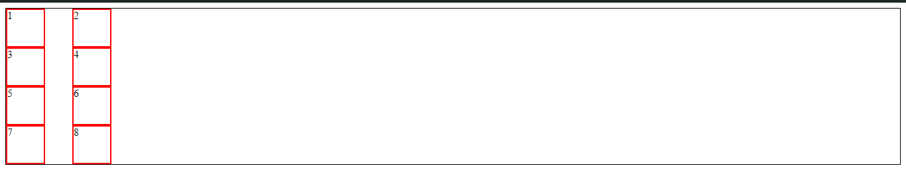
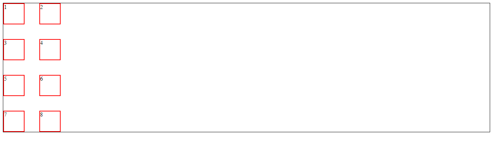

# Grid Template Columns

```
.container{
	border: 1px solid;
	display: grid;
	grid-template-columns: 100px 120px;
}

.item{
	height: 55px;
	width: 55px;
	border: 2px solid red;
}	
```


--
# Grid Template Rows

```
.container{
	display: grid;
	grid-template-columns: 100px 120px;
	grid-template-rows: 100px 100px 100px;
}
```

--
