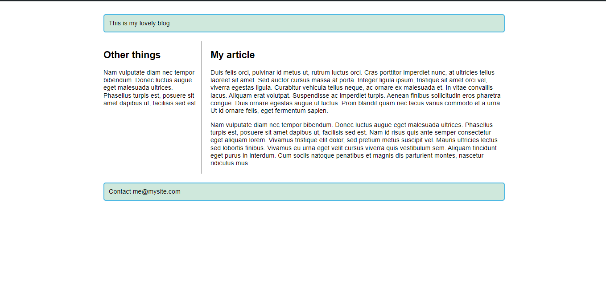
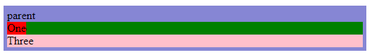

# Parent child Center


---

# Grow and fill the container
```
.wrapper {
    display: flex;
    background-color: red;
    padding: 20px;
}

.wrapper>div {
    flex: 1;
}
```

---

# Grid Intro
```
.wrapper {
    display: grid;
    grid-template-columns: 1fr 1fr 1fr;
    grid-template-rows: 100px 100px 100px;
    gap: 10px;
}
```

---

# Placing items on grid
```
.container {
    display: grid;
    grid-template-columns: 1fr 1fr 1fr;
    grid-template-rows: 100px 100px;
    gap: 10px;
    margin: 5px;
}

.box1 {
    grid-column: 2/4;
    grid-row: 1;
    background-color: blue;
    color: white;
    text-align: center;
}

.box2 {
    grid-column: 1;
    grid-row: 1 / 3;
    background-color: blue;
    color: white;
    text-align: center;
}

.box3 {
    grid-row: 2;
    grid-column: 3;
    background-color: blue;
    color: white;
    text-align: center;
}
```

---

# Float
```
.float {
    background-color: red;
    color: white;
    border-radius: 10px;
    width: 100px;
    height: 100px;
    float: left;
    margin-right: 30px;
}
```

---

# position
## relative
```
.child-one {
    position: relative;
    top: 10px;
    left: 20px;
}
```

---
## absolute
```
.child-one {
    position: absolute;
}
```


```
.parent {
    position: relative;
}

.child-one {
    position: absolute;
    top: 0;
}
```

---
## fixed
```
.child-one {
    position: fixed;
    right: 0;
    top: 0;
}
```

---

## sticky
```
.child-one {
    position: sticky;
    top: 0;
}
```

---

## Multi-Column
```
.container {
    column-width: 200px;
}
```

---