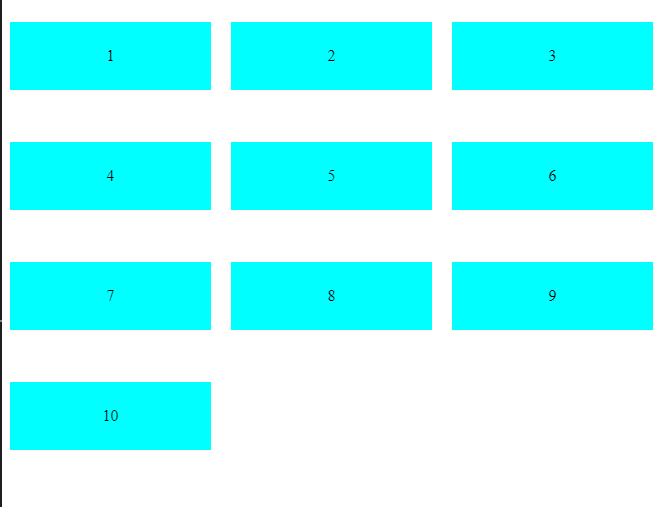
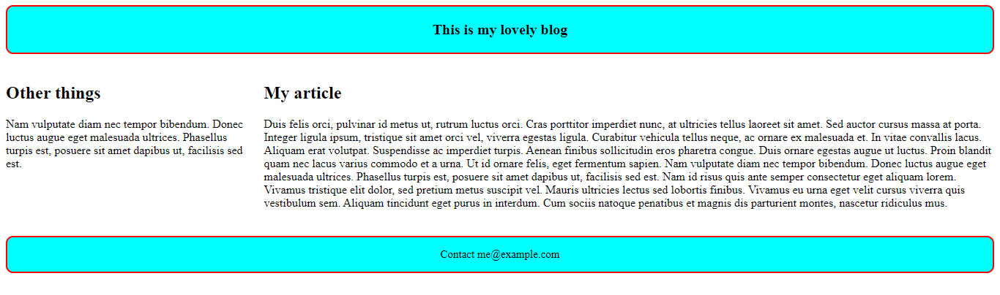

# Grid

```
.container {
    display: grid;
    grid-template-columns: 1fr 1fr 1fr 1fr 1fr;
    grid-template-rows: 100px 100px;
}

p {
    background-color: aqua;
    display: flex;
    align-items: center;
    justify-content: center;
}
```

---
```
.container {
    display: grid;
    grid-template-columns: 1fr 1fr 1fr 1fr 1fr;
    grid-template-rows: 100px 100px;
    gap: 20px;
}
```

---

```
.container {
    display: grid;
    grid-template-columns: repeat(3, 1fr);
    grid-template-rows: repeat(4, 100px);
    gap: 20px;
}
```

---

# Second
```
<style>
    .container {
        display: grid;
        grid-template-areas:
            "header header"
            "sidebar content"
            "footer footer";
        grid-template-columns: 1fr 3fr;
        gap: 20px;
    }

    header {
        grid-area: header;
        background-color: aqua;
        padding: 20px;
        text-align: center;
        border-radius: 10px;
        font-size: 20px;
        font-weight: 900;
        border: 2px solid red;
    }

    article {
        grid-area: content;
    }

    aside {
        grid-area: sidebar;
    }

    footer {
        grid-area: footer;
        background-color: aqua;
        text-align: center;
        border-radius: 10px;
        font-size: 15px;
        border: 2px solid red;
    }
</style>

<body>
    <div class="container">
        <header>
            This is my lovely blog
        </header>

        <article>
            <h1>My article</h1>
            <p>
                Duis felis orci, pulvinar id metus ut, rutrum luctus orci. Cras porttitor imperdiet nunc, at ultr

                Nam vulputate diam nec tempor bibendum. Donec luctus augue eget malesuada ultrices. Phasellus turpis
                est,
                posuere sit amet dapibus ut, facilisis sed est. Nam id risus quis ante semper consectetur eget aliquam
                lorem. Vivamus tristique elit dolor, sed pretium metus suscipit vel. Mauris ultricies lectus sed
                lobortis
                finibus. Vivamus eu urna eget velit cursus viverra quis vestibulum sem. Aliquam tincidunt eget purus in
                interdum. Cum sociis natoque penatibus et magnis dis parturient montes, nascetur ridiculus mus.
            </p>
        </article>

        <aside>
            <h1>Other things</h1>
            <p>Nam vulputate diam nec tempor bibendum. Donec luctus augue eget malesuada ultrices. Phasellus turpis est,
                posuere sit amet dapibus ut, facilisis sed est.
            </p>
        </aside>

        <footer>
            <p>Contact me@example.com</p>
        </footer>
    </div>
</body>
```

---

## optimized


---